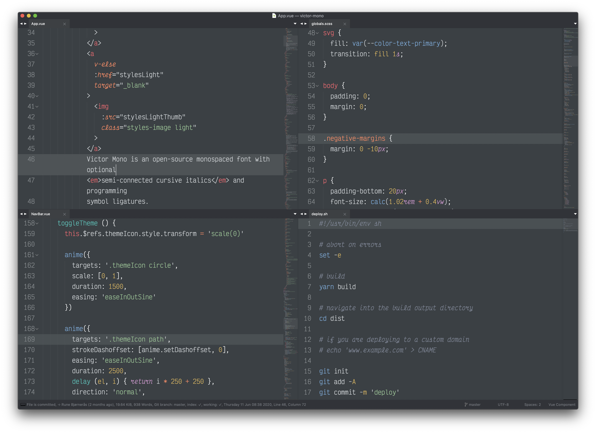

# Ultimate Dark Neo

My second take on the ultimate dark colour theme/scheme for code (main focus: finding pleasant settings for HTML/CSS/JS).

Based on Sublime Text's built-in Mariana scheme and kkga's Spacegray (https://github.com/kkga/spacegray)

*The font used in the screenshot is [__Victor Mono__](https://rubjo.github.io/victor-mono).*

***

### Installation

#### Via Package Control

The easiest way to install is using [Sublime Package Control](https://sublime.wbond.net).

1. Open Command Palette using menu item `Tools -> Command Palette...` (<kbd>⇧</kbd><kbd>⌘</kbd><kbd>P</kbd> on Mac)
2. Choose `Package Control: Install Package`
3. Find `Ultimate Dark Neo` and hit <kbd>Enter</kbd>

#### Manually

You can also install the theme manually:

1. [Download the .zip](https://github.com/rubjo/ultimate-dark-neo/archive/master.zip)
2. Unzip and rename the folder to `Ultimate Dark Neo`
3. Copy the folder into `Packages` directory, which you can find using the menu item `Sublime Text -> Preferences -> Browse Packages...`

***

### Activation

You can activate the colour scheme by modifying your Preferences-User file which you can find by using the menu item `Sublime Text -> Preferences -> Settings - User` (<kbd>⌘</kbd><kbd>,</kbd> on Mac).

***

### Credits and inspiration:

- Sublime Text's built-in Mariana scheme
- kkga's Spacegray (https://github.com/kkga/spacegray)
